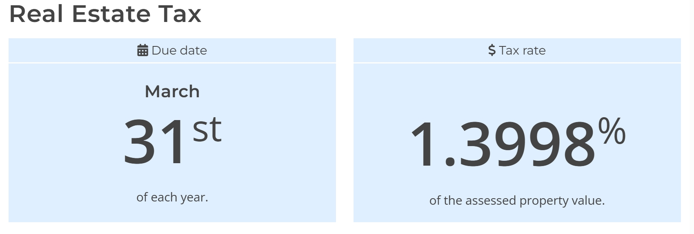
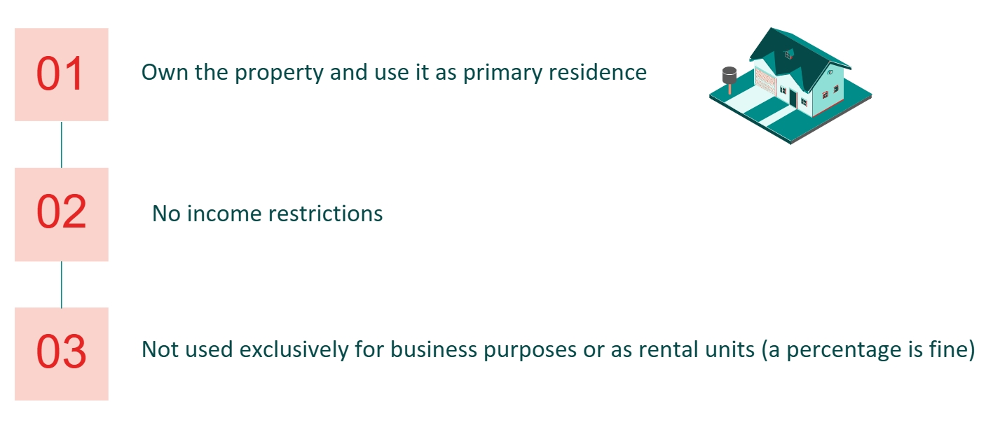
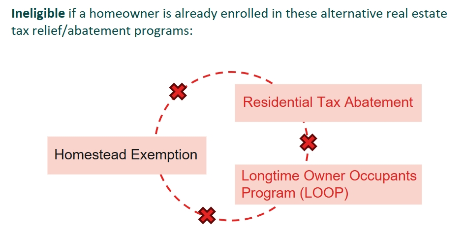
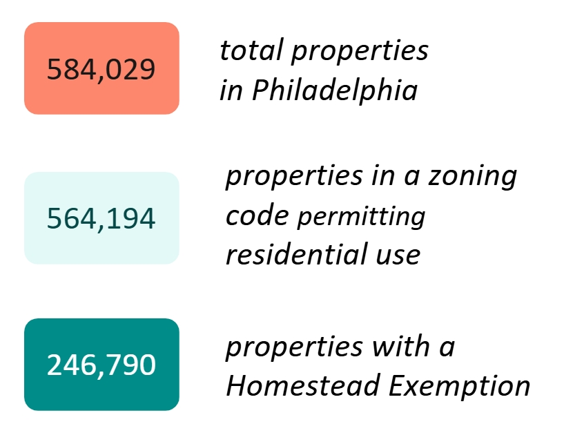
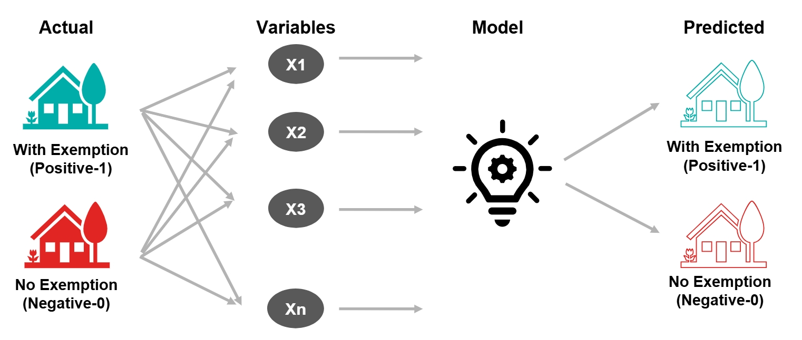
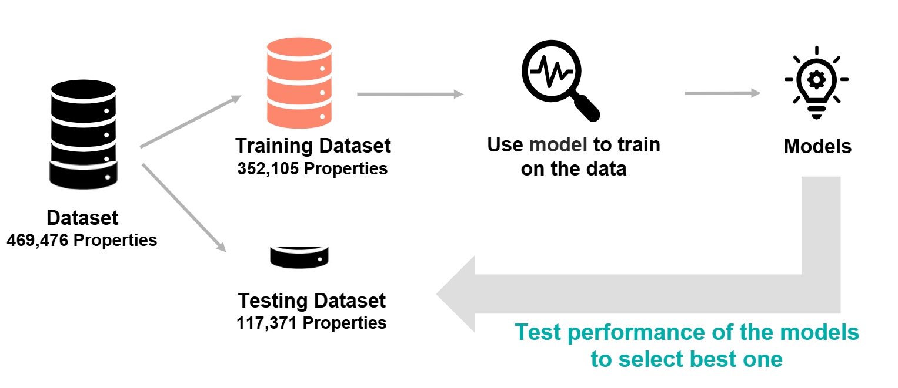
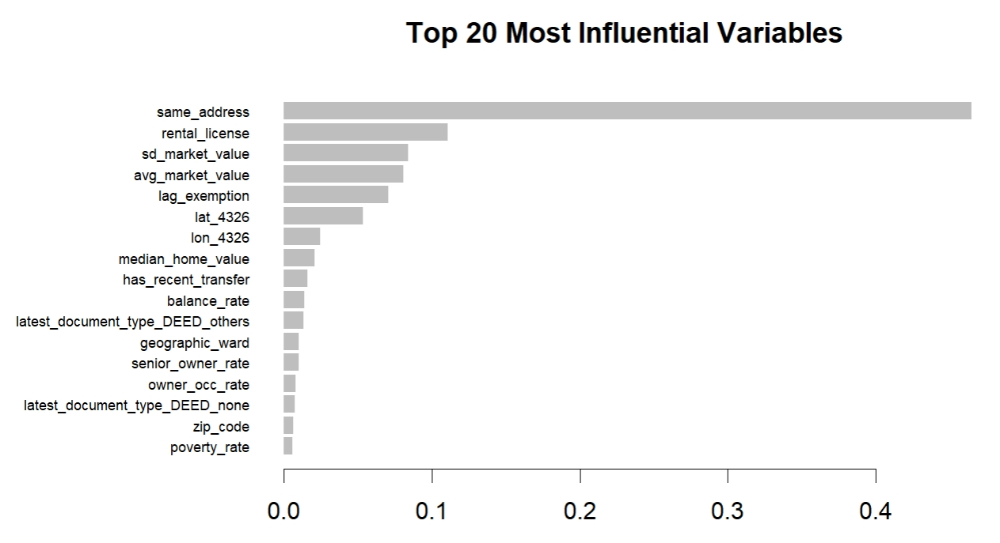
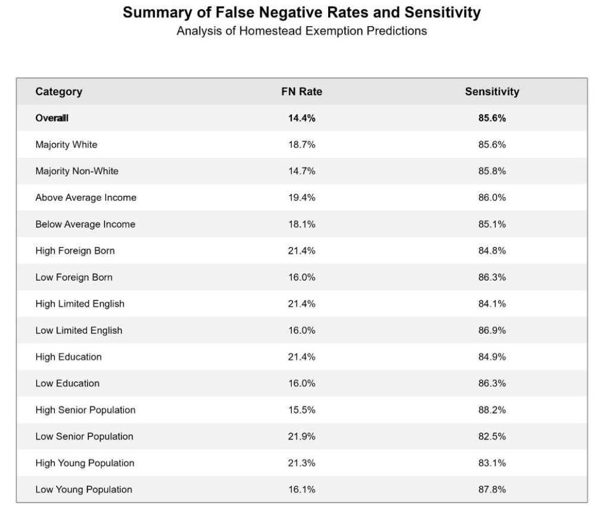
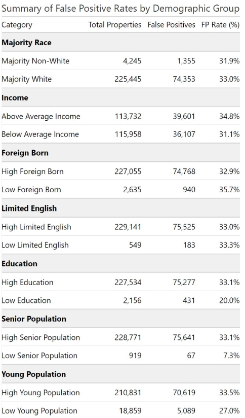
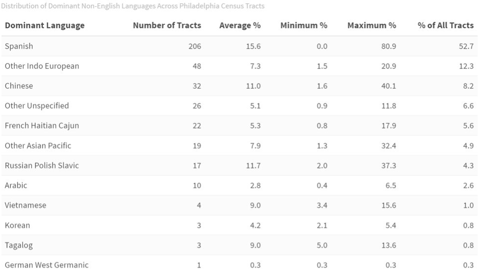

```{r setup, include=FALSE}
knitr::opts_chunk$set(echo = FALSE, message = FALSE, warning = FALSE, results='hide', cache = FALSE)

library(tidycensus)
library(tidyverse)
library(dplyr)
library(sf)
library(spdep)
library(caret)
library(ckanr)
library(FNN)
library(grid)
library(gridExtra)
library(ggcorrplot) 
library(corrr)    
library(kableExtra)
library(jtools)   
library(ggstance)
library(ggpubr) 
library(broom.mixed)
library(RColorBrewer)
library(dplyr)
library(ggplot2)
library(RColorBrewer)
library(corrr)
library(classInt)
library(stargazer)
library(RSocrata)
library(kableExtra)
library(caret)
library(knitr) 
library(pscl)
library(plotROC)
library(pROC)
library(lubridate)
library(stargazer)
library(caret)
library(knitr) 
library(pscl)
library(plotROC)
library(pROC)
library(scales)
library(stringr)
library(car)
library(data.table)
library(leaflet)
library(knitr)
library(kableExtra)
library(gt)

options(scipen = 999)
root.dir = "https://raw.githubusercontent.com/urbanSpatial/Public-Policy-Analytics-Landing/master/DATA/"
source("https://raw.githubusercontent.com/urbanSpatial/Public-Policy-Analytics-Landing/master/functions.r")

# Inflation adjust
inflationAdjust2017 <- 1.0213
inflationAdjust2018 <- 1.0244

# Set up theme and options
colors2 <- c("0" = "#e42524", "1" = "#00ADA9")
colors6 <- c("#e42524", "#ea7357",  "#f0b48b", "#96d2c7", "#41c3b4", "#00ADA9")

map_theme <- theme_minimal() +
  theme(
    axis.text = element_blank(),
    axis.title = element_blank(),
    panel.grid = element_blank()
  )

base_theme <- theme_minimal(base_size = 12) +
  theme(
    panel.grid.major = element_line(color = "grey90"),
    panel.grid.minor = element_blank(),
    legend.position = "bottom",
    plot.title = element_text(size = 16, face = "bold"), 
    plot.subtitle = element_text(size = 12),
    axis.title = element_text(size = 10),
    axis.text = element_text(size = 10),
    legend.text = element_text(size = 10)
  )

options(tigris_use_cache = TRUE)
options(scipen = 999)
```

# Introduction

This report provides a detailed workflow of the project on Homestead Tax Exemption entitlement assistance outreach, for the City of Philadelphia Office of Philly Stat 360 and Office of Information Technology. The aim of the project is design an algorithm-driven outreach campaign that can cost effectively identify homeowners who are likely to be eligible for the [Homestead Tax Exemption](https://www.phila.gov/services/payments-assistance-taxes/taxes/property-and-real-estate-taxes/get-real-estate-tax-relief/get-the-homestead-exemption/) but are not participating in the program. The project aims to allow our clients to understand where these properties are located, potential outreach strategies, and the associated costs and benefits.


These relevant properties who are identified as most likely eligible for the Homestead Exemption but not taking up the program,  are also thought to be more likely to be subject to “tangled titles,” or family-rental arrangements that require an affidavit to waive need for a rental license.

## Background on Property Tax in Philadelphia
Property tax in Philadelphia is **1.3998% of the property value**, as assessed by the Office of Property Assessment,for the 2025 tax year. This is made up of 0.6159% (City of Philadelphia) and 0.7839% (School District)
The taxes are due March 31st yearly.



## Background on Homestead Exemption
The Homestead Exemption reduces the taxable portion of a homeowner's property assessment by up to $100,000, saving up to $1,399 on real estate taxes annually. The bill signed aimed to lessen the financial burden of new property assessments on Philadelphia homeowners, whose property values increased by an average of 31% after the city delayed the annual calculations for three years due to the pandemic.

Eligibility for the Homestead Exemption is as follows:



A homeowner is Ineligible if a homeowner is already enrolled in these alternative real estate tax relief/abatement programs:
•	Longtime Owner Occupants Program (LOOP), an	income-based program for homeowners who experience a substantial increase in their property assessment.
•	10-year residential tax abatement program, although one can only apply for Homestead Exemption after the abatement is over



Programs that can be used in conjunction with the homestead exemption include 
•	Owner-Occupied Real Estate Tax Payment Agreement (OOPA)
•	Senior Citizen Real Estate Tax Freeze
•	Low-Income Real Estate Tax Freeze
•	Real Estate Tax Installment Plan
• Tax Credits for Active-Duty Reserve and National Guard Members

## Tangled Titles
An issue of concern that may result in a long-term resident not being able to claim for homestead exemption is tangled titles, which occur when a long-term resident effectively functions as a homeowner but lacks legal ownership of the property. This often happens when a family member who owned the property passes away, and the necessary legal processes to formalize the ownership transfer were never completed, leaving the resident ineligible for the exemption. However, Philadelphia has a conditional Homestead Exemption of three years for such cases while the legal transfer of ownership is resolved.

## Significance of Outreach 
Currently, no focused or strategic efforts are being carried out by to identify and reach homeowners who is not enrolled in the Homestead Exemption. Through an accurate identification of eligible homeowners, a cost-effective and efficient targeted outreach will be possible, enabling these homeowners to be made aware of and receive support in keeping their home.

# Exploratory Data Analysis

## Dependent Variable - Homestead Exemption

The primary dataset used is the Property and Assessment History publicly available for download on [OpenDataPhilly](https://opendataphilly.org/). Six relevant datasets are merged with this primary dataset with common identifying keys such as the parcel number in order to include useful predictor variables in the model predicting for homeowners most likely eligible but not currently enrolled in the Homestead Exemption.

Every observation in the Property and Assessment History dataset is one property in Philadelphia, with a total of 584,049 properties and 79 features. As this dataset is updated daily, the one used for this project is updated as of 31 January 2025. 

There is a column `homestead_exemption` within this dataset which indicates the taxable portion amount removed from the property assessment of the house. It should be noted that there are 14 properties that had a homestead exemption larger then $100,000, the maximum possible amount, which is suspected to be a clerical error and has been flagged to the PhillyStat360 team. The dependent variable for the model is derived from this feature by creating a binary variable on whether or not the property is currently enrolled in the homestead exemption program, indicated by a non-zero value. There are 246,853 properties with a homestead exemption.



```{r read data, echo=FALSE, message=FALSE, warning=FALSE, fig.show='hold'}
properties <- fread("data/opa_properties_public.csv")
census_tracts <- st_read("Data/phila_census1.gpkg")
```

```{r prepare property data, echo=FALSE, message=FALSE, warning=FALSE, fig.show='hold'}

# Filtering to residential properties
filtered_properties_resonly <- properties %>% 
  mutate(exemption = ifelse(homestead_exemption == 0, 0, 1))%>%
  mutate(is_residential = ifelse(zoning %in% c(
  "RM1", "RM2", "RM3", "RM4",
  "RSA1", "RSA2", "RSA3", "RSA4", "RSA5", "RSA6", 
  "RSD1", "RSD2", "RSD3", 
  "RM1|RSA5", "RSD1|RSD3", "RSA5|RSA5",
  "RTA1", 
  "CMX1", "CMX2", "CMX2.5", "CMX3", "CMX4", "CMX5", "IRMX"), 1, 0))

# Step 1: Identify owners to remove
ownerstoremove <- properties %>%
  group_by(owner_1) %>%
  summarise(property_count = n(), .groups = "drop") %>%
  filter(str_detect(owner_1, " LLC | LLC|REAL ESTATE|ASSOC|HALABUGI INC|INVESTMENT|CHURCH|1229-1247 NORTH 27TH ST|KINGS HIGHWAY|VILLAGE|
  ACQUISITION|PARTNERS|2101 WASHINGTON AVENUE LL|CHAI NUTS LP|REALTY|PROPERTIES|SPECIAL PEOPLE IN NORTHEA|COMPANY|SPECIAL|
  LAND TRUST|TRUST|SIENA PLACE PLANNED COMMU|NORRIS SQUARE NEIGHBORHOO|201-59 NORTH EIGHTH|PREPARATOR|INVESTORS|
  POINT BREEZE|WPRE III L P|NATIONAL|ARCH V-TEMPLE 16TH STREET|NORTH FOURTH STREET|BANKERS TRUST|COMMONS AT POINT BREEZE|
  VETERAN|PRESERVATION|CONDOMINIUM|199 HUNTING PARK|APARTMENT|HOLDINGS| L P|COURT|SCHOOL|SERVICES|HABITAT FOR HUMANITY|COMMITTEE|BAPTIST|
  COLLEGE|ACQUISITION|DELEO|AMTRAK|RENTALS|PARTICIPATION|SPRING ARTS|SEPTA|WASHINGTON SQUARE|FAIRMOUNT PARK|PARKING|
  ARCH VI - TEMPLE|THE LOFTS|FUND |WHARTON COURT|GROUP|PENTECOST|RAD DIVERSIFIED REIT INC|COMMONS|LIMITED|PENNA |FIRST|CONTRACTOR|POINT BREEZE|BOOTSTRAP|RITTENHOUSE|
  HABITAT FOR HUMANITY|DELAWARE RIVER|ENTERPRISES|COMMUNITY|FOUNDATION|BELL TELEPHONE CO|CENTER|PARTNERS|DEVELOPMENT|
  VET AFFAIRS|FEDERAL|WORKFORCE|PENNDOT|INVESTORS|GEORGE WOODWARD INC|HARRISON INC|JDJ FUND|AFFORDABLE|INTERSTATE| INC |BIO LUCKY STAR INC|LEANNA INC|ELEBAH INC|BENGEMINI CONSULTANTS INC|BUILDERS|KOREAN COMMUNITY DEVELOPM|DEVELOPERS|
  PORTFOLIO|RESIDENTIAL|PHILLY|PROJECT|MANAGEMENT|UMOJA INC|ASSN INC|DELAWARE VALLEY|ARCH VI - TEMPLE N GRATZ|SUPPLY|LOFTS|STREET|OFFICE| LP|CITY|VENTURES|
  UNITED STATES OF AMERICA|PHILA|NON PROFIT|ASSO|HOUSE|NEIGHBORHOOD|PATH INC|UNIV|HOUSING|PROPERTY|COMMONWEALTH|CONRAIL|COMMERCE|
  VENTURES|UNITED|CORRIDOR|SQUARE|CIVIC|ARMY|SALVATION|PENNSYLVANIA|ADMINISTRATOR|TOWNHOMES|CBM|RENTAL|AMERICA INC|ST FRANCIS INN|HOMEOWNERSHIP|
  INSTITUTE|RESOURCES|CONSTRUCTION|L P|TRANSPORTATION|CSX|DREXEL|PASSYUNK|COLLEGE|WISTERCOR INC|SIENA PLACE PUD|EQUITY| CAPITAL|EXPORT|STRAWBERRY MANSION|7-ELEVEN|KEEP PLUGGING THREE INC|OUTSOURCE 2000 INC|CHAI 18 INC|Y E R A INC |WORLD|ADMIN|U S OF AMERICA|AUTHORITY|
  SEPTA|APTS| LTD|CORP")) %>%
  pull(owner_1)  # Extract the list of owners to remove

# Step 2: Filter out properties owned by these owners
filtered_properties <- filtered_properties_resonly %>%
  filter(!owner_1 %in% ownerstoremove)

# Look into exemption status by zoning code
exemptionbyzoning <- filtered_properties %>%
  group_by(zoning, exemption) %>%
  summarise(count = n(), .groups = "drop") %>%
  tidyr::pivot_wider(names_from = exemption, values_from = count, values_fill = list(count = 0)) %>%
  rename(No_Exemption = `0`, Exemption = `1`)

residential_properties <- filtered_properties %>% filter(is_residential == 1)
```

```{r prepare sf data, echo=FALSE, message=FALSE, warning=FALSE, fig.show='hold'}
#### Transform to geodata in both 2272 and 4326 planes
properties_sf <- st_as_sf(residential_properties, wkt = "shape", crs = 2272)

residential_properties <- properties_sf %>%
  mutate(
    x_2272 = st_coordinates(.)[,1],  # X coordinate in EPSG:2272
    y_2272 = st_coordinates(.)[,2]   # Y coordinate in EPSG:2272
  ) %>%
  st_transform(crs = 4326) %>%
  mutate(
    lon_4326 = st_coordinates(.)[,1],  # Longitude in EPSG:4326
    lat_4326 = st_coordinates(.)[,2]   # Latitude in EPSG:4326
  ) %>%
  st_drop_geometry()

census_tracts <- st_transform(census_tracts, 2272) %>% 
  mutate(owner_occ_rate = (owner_hh / occupied_units)* 100)

properties_tract <- st_join(properties_sf, census_tracts)

# Create tract summary
tract_summary <- properties_tract %>%
  group_by(GEOID) %>%
  summarise(
    total_properties = n(),
    homestead_count = sum(homestead_exemption > 0, na.rm = TRUE),
    pct_homestead = (homestead_count / total_properties) * 100,
    .groups = "drop"
  ) %>%
  st_drop_geometry()

# Create final enriched dataset
census_tracts_enriched <- census_tracts %>%
  left_join(tract_summary, by = "GEOID")

census_tracts_enriched <- census_tracts_enriched %>%
  mutate(
    owner_occ_rate = (census_tracts_enriched$owner_hh / census_tracts_enriched$occupied_units) * 100
  )
```

### Homestead Rate by Census Tract {.tabset}

First, we take a look at the distribution of homestead exemption rates by census tract.

#### Quantitative Distribution {.unnumbered}
 
The distribution of homestead exemption rates across census tracts is approximately normal, with most tracts clustered between 30% and 50%. A notable decline occurs below the 30% threshold, and very few tracts fall below 20%. Tracts with exemption rates under 30% may indicate low participation. If these areas are primarily residential, such figures may warrant targeted outreach or further investigation into potential barriers to enrollment.

```{r Quantitative Distribution, echo=FALSE, message=FALSE, warning=FALSE, fig.show='hold'}
census_tracts_filtered <- census_tracts_enriched %>%
  filter(pop_density > 0 & total_properties >= 30)  # 30 properties minimum

census_tracts_invalid <- census_tracts_enriched %>%
  filter(pop_density == 0 | total_properties < 30)  # Include low property counts in "invalid"

ggplot(census_tracts_enriched %>% filter(pop_density > 0),
       aes(x = pct_homestead)) +
  geom_histogram(
    binwidth = 5, fill = "#00ADA9", color = "white"
  ) +
  labs(
    title = "Distribution of Homestead Exemption Rates Across Philadelphia Census Tracts",
    subtitle = "Excluding Zero Population Density Tracts",
    x = "Percentage of Properties with Homestead Exemption",
    y = "Number of Census Tracts"
  ) +
  base_theme +
  scale_x_continuous(breaks = seq(0, 100, by = 10))
```

#### Spatial Distribution {.unnumbered}

Spatially, homestead exemption rates tend to be lower in the central areas of the city compared to the outskirts. This pattern likely reflects a higher proportion of rental or non-residential properties in the urban core, which are less eligible for exemptions. In contrast, peripheral neighborhoods—with more owner-occupied housing—generally exhibit higher rates of participation.

```{r Spatial Distribution, echo=FALSE, message=FALSE, warning=FALSE, fig.show='hold'}
custom_colors <- c("<20%" = "#e42524",     
                   "20-30%" = "#ea7357",    
                   "30-40%" = "#f0b48b",   
                   "40-50%" = "#96d2c7",   
                   "50-60%" = "#41c3b4",    
                   ">60%" = "#00ADA9")

ggplot(census_tracts_enriched %>%
         mutate(pct_homestead = case_when(
           pop_density < 2000 | total_properties < 100 ~ NA_real_,
           TRUE ~ pct_homestead))) +
  geom_sf(aes(fill = cut(pct_homestead, 
              breaks = c(0, 20, 30, 40, 50, 60, 100),
              labels = c("<20%", "20-30%", "30-40%", "40-50%", "50-60%", ">60%"))),
          color = "white", size = 0.2) +
  scale_fill_manual(
    name = "Homestead\nExemption Rate",
    values = custom_colors,
    na.value = "gray95",
    guide = guide_legend(reverse = TRUE)
  ) +
  labs(
    title = "Homestead Exemption Rates Across Philadelphia",
    subtitle = "By Census Tract",
    caption = "Gray tracts indicate population density < 2,000 per sq. mile or fewer than 100 properties"
  ) +
  base_theme +
  theme(
    panel.grid = element_blank(), 
    axis.text = element_blank(), 
    legend.position = "right"
  )

```

```{r ADD_Spatial_lag, eval=FALSE}
knn_nb <- knn2nb(knearneigh(xgb_full_pred_sf, k = 4, use_kd_tree = FALSE))

exemption_data <- as.factor(properties_full_pred_sf$exemption)
join_count_test <- joincount.test(exemption_data, listw = nb2listw(knn_nb, style = "B"))

lw <- nb2listw(knn_nb, style = "W") 
properties_full_pred_sf$lag_exemption <- lag.listw(lw, properties_full_pred_sf$exemption)
```


## Predictors

### Current Propertiy Characteristics {.tabset}

We examine several property-level characteristics that may influence eligibility or participation in the Homestead Exemption program, including ownership status (e.g., corporate ownership) and whether the owner's mailing address matches the property address.

One of the key eligibility criteria for the Homestead Exemption is that the property must serve as the homeowner’s primary residence. To approximate this, we explore the match between the mailing street address (`mailing_street`) and the property location address (`location`) and use it as an predictor. A matching address may suggests that the owner resides at the property.

Another important factor is owner participation in other tax relief programs. Properties already receiving benefits from programs such as LOOP (Longtime Owner Occupants Program) or the Residential Tax Abatement are generally ineligible for the Homestead Exemption. To capture this, we use the exempt-building variable. If this value is non-zero and the property is not enrolled in the Homestead Exemption, it may indicate participation in one of these alternative programs.

The Homestead Exemption also requires that a property is not used exclusively for business or rental purposes—partial use is allowed. We operationalize this rule with two binary variables. We explore its rental Potential by defining the presence of an active rental license and business potential by defining the presence of a business license (excluding rental licenses).

#### Same Address {.unnumbered}

Properties enrolled in the Homestead Exemption are more likely to have the owner's mailing address match the property address, indicating primary residence. 

```{r same_address, echo=FALSE, message=FALSE, warning=FALSE, fig.show='hold'}
residential_properties <- residential_properties %>% 
  mutate(same_address = ifelse(mailing_street == location, 1, 0))

ggplot(residential_properties, aes(x = same_address, fill = as.factor(exemption))) +
  geom_bar(position = "dodge") +
  scale_fill_manual(values = colors2, labels = c("No Exemption", "With Exemption")) +
  labs(
    title = "Mailing Address Matches Property Address",
    x = "Address Match",
    y = "Count",
    fill = "Homestead Exemption"
  ) +
  base_theme
```

#### Owner Count Address {.unnumbered}

Enrolled properties are more likely to be owned by individuals or entities with fewer than 10 properties, suggesting smaller-scale ownership.

```{r owner_count, echo=FALSE, message=FALSE, warning=FALSE, fig.show='hold'}
## Count the number of properties by owner_1
owner_property_count <- filtered_properties %>%
  group_by(owner_1) %>%
  summarise(property_count = n(), .groups = "drop") %>%
  arrange(desc(property_count))%>%
  mutate(owner_count = ifelse(property_count >= 10, 1, 0))

residential_properties <- residential_properties %>%
  left_join(owner_property_count %>%dplyr::select(owner_1, owner_count), 
            by = "owner_1") %>%
  mutate(owner_count = ifelse(is.na(owner_count), 0, owner_count))

ggplot(residential_properties, aes(x = as.factor(owner_count), fill = as.factor(exemption))) +
  geom_bar(position = "dodge") +
  scale_fill_manual(values = colors2, labels = c("No Exemption", "With Exemption")) +
  labs(
    title = "Owner Count by Homestead Exemption",
    x = "Owner Count > 10",
    y = "Count",
    fill = "Homestead Exemption"
  ) +
  base_theme

```

#### Rental Licenses {.unnumbered}

Properties receiving the exemption tend not to hold active rental licenses.

```{r rental license, echo=FALSE, message=FALSE, warning=FALSE, fig.show='hold'}
business_license<-st_read("Data/business_licenses.geojson")

rental_license<-business_license%>%
  filter(licensetype=="Rental",
         licensestatus %in% c("Active"))%>%
  dplyr::select(opa_account_num)%>%
  st_drop_geometry()%>%
  distinct() %>% 
  filter(!is.na(opa_account_num)) %>% 
  mutate(rental_license = 1)  

properties_rental <- properties_sf %>%
  mutate(parcel_number = as.character(parcel_number))%>%
  left_join(rental_license, by = c("parcel_number" = "opa_account_num"))%>%
  mutate(rental_license = replace_na(rental_license, 0))

residential_properties <- residential_properties %>%
  left_join(properties_rental%>%st_drop_geometry()%>%dplyr::select(objectid,rental_license), 
            by = c("objectid" = "objectid"))

ggplot(properties_rental, 
       aes(x = factor(rental_license), fill = as.factor(exemption))) +
  geom_bar(position = "dodge") +
  scale_fill_manual(values = colors2, labels = c("No Exemption", "With Exemption")) +
  labs(
    title = "Rental Licenses by Homestead Exemption",
    x = "Rental License",
    y = "Count",
    fill = "Homestead Exemption"
  ) +
  base_theme

```

#### Commertial Licenses {.unnumbered}

Properties receiving the exemption tend not to have active commercial (non-rental) business licenses.

```{r Business License Exclude Rental, echo=FALSE, message=FALSE, warning=FALSE, fig.show='hold'}
commercial_license<-business_license%>%
  filter(licensestatus %in% c("Active"))%>%
  filter(licensetype %in% c(
    "Food Caterer",
    "Food Establishment, Retail Perm Location (Large)",
    "Food Establishment, Retail Permanent Location",
    "Food Manufacturer / Wholesaler",
    "Food Preparing and Serving",
    "Food Preparing and Serving (30+ SEATS)",
    "Motor Vehicle Repair / Retail Mobile Dispensing",
    "Pawn Shop",
    "Precious Metal Dealer",
    "Public Garage / Parking Lot",
    "Residential Property Wholesaler",
    "Tire Dealer",
    "Tow Company",
    "Vacant Commercial Property"
  ))%>%
  dplyr::select(opa_account_num)%>%
  st_drop_geometry()%>%
  distinct() %>% 
  filter(!is.na(opa_account_num)) %>% 
  mutate(commercial_license = 1) 

properties_commercial <- properties_sf %>%
  mutate(parcel_number = as.character(parcel_number))%>%
  left_join(commercial_license, by = c("parcel_number" = "opa_account_num"))%>%
  mutate(commercial_license = replace_na(commercial_license, 0))


residential_properties <- residential_properties %>%
  left_join(properties_commercial%>%
              st_drop_geometry()%>%
              dplyr::select(objectid,commercial_license), 
            by = c("objectid" = "objectid"))

ggplot(properties_commercial, 
       aes(x = factor(commercial_license), fill = as.factor(exemption))) +
  geom_bar(position = "dodge") +
  scale_fill_manual(values = colors2, labels = c("No Exemption", "With Exemption")) +
  labs(
    title = "Commercial Licenses by Homestead Exemption",
    x = "Commercial License (Exclude Rental)",
    y = "Count",
    fill = "Homestead Exemption"
  ) +
  base_theme

```

### Historical Property Characteristics {.tabset}

We also examine the historical characteristics of properties, focusing on transfer history and assessment trends over time.

Using residential property assessment data from 2015 to 2025, we compare properties with and without Homestead Exemptions in terms of their average market value and the variability (standard deviation) of that value. This allows us to assess whether exempt properties tend to be more stable or differ systematically in value.

We also analyze year-over-year changes in taxable building values to identify typical patterns of property tax growth, as well as deviations potentially linked to major economic events.

Additionally, we explore property transfer records to better understand the ownership dynamics of exempt properties. We compare exemption rates across different deed types to investigate whether certain forms of property transfer are more commonly associated with exemption enrollment.

#### Market Value {.unnumbered} 

Properties without exemptions have significantly higher average market values ($304,731 compared to $182,169) and higher variability ($78,513 versus $42,479). This suggests that non-exempt properties tend to have higher market values and experience greater market fluctuations over time. In contrast, exempt properties have lower but much more stable market values, meaning homeowners without exemptions are less vulnerable to sudden market shocks.

```{r Market_Value, echo=FALSE, message=FALSE, warning=FALSE, fig.show='hold'}
# Load and inspect the assessments dataset
assessments2 <- fread("Data/assessments.csv")

# Merge properties and assessments data by parcel_number
cleaned_properties <- filtered_properties %>%
  dplyr::select(parcel_number, exemption, is_residential, shape)
assessment_combined <- assessments2 %>%
  left_join(cleaned_properties, by = "parcel_number")

# Filter the combined dataset to include only residential properties
residential_assessment_combined <- assessment_combined %>%
  filter(is_residential == 1)

# Summarize key metrics for each parcel: mean, growth rate, and standard deviation
residential_summary <- residential_assessment_combined %>%
  group_by(parcel_number) %>%
  summarise(
    avg_market_value = mean(market_value, na.rm = TRUE),
    sd_market_value = sd(market_value, na.rm = TRUE)
  )

# Add exemption and residential status to the summary dataset
residential_summary <- residential_summary %>%
  left_join(
    residential_assessment_combined %>%
      dplyr::select(parcel_number, exemption, is_residential, shape) %>%
      distinct(parcel_number, .keep_all = TRUE),  # Keep one row per parcel_number
    by = "parcel_number"
  )

#join to dataset
residential_properties <- residential_properties %>%
  left_join(residential_summary %>%
              dplyr::select(parcel_number,avg_market_value,sd_market_value), 
            by = c("parcel_number" = "parcel_number"))

# Analysis by Exemption Status
# Summarize metrics by exemption status
residential_summary_analysis <- residential_summary %>%
  group_by(exemption) %>%
  summarise(
    avg_market_value = mean(avg_market_value, na.rm = TRUE),
    sd_market_value = mean(sd_market_value, na.rm = TRUE)
  ) 

summary_filtered <- residential_summary_analysis %>%
  pivot_longer(
    cols = -exemption, 
    names_to = "metric", 
    values_to = "value"
  )%>%
  filter(metric %in% c("avg_market_value", "sd_market_value"))

ggplot(summary_filtered, aes(x = metric, y = value, fill = as.factor(exemption), color = as.factor(exemption))) +
  geom_bar(stat = "identity", position = position_dodge(width = 0.7), width = 0.6, alpha = 0.85) + 
  ylim(0, max(summary_filtered$value) * 1.2) +
  scale_fill_manual(values = colors2, labels = c("No Exemption", "With Exemption")) +
  scale_color_manual(values = colors2, guide = "none") +  
  labs(title = "Average and Standard Deviation of Market Value (2015-2025)",
       x = "Metric", 
       y = "Value ($)", 
       fill = "Exemption Status") +
  base_theme 

```


#### Yearly Trends in Residential Data {.unnumbered}

By plotting the yearly taxable building values for exempt and non-exempt properties from 2015 to 2025, we observed that non-exempt properties experienced a significantly faster increase in taxable values compared to exempt properties. This long-term trend indicates that non-exempt homeowners have been more exposed to steadily rising tax burdens over time. Moreover, the sharper changes observed between 2022 and 2025 further highlight how non-exempt properties responded more sensitively to broader economic shifts, whereas exempt properties remained relatively insulated, maintaining a more stable taxation trajectory.

```{r Yearly Trends, echo=FALSE, message=FALSE, warning=FALSE, fig.show='hold'}
yearly_residential_data <- assessments2 %>%
  inner_join(cleaned_properties, by = "parcel_number") %>%
  filter(is_residential == 1)  # Keep only residential properties

# Summarize yearly residential data by exemption status
yearly_residential_summary <- yearly_residential_data %>%
  group_by(year, exemption) %>%
  summarise(taxable_building = mean(taxable_building, na.rm = TRUE),
    .groups = "drop"
  )

yearly_residential_summary %>%
  filter(year >= 2015) %>%
  ggplot(aes(x = year, y = taxable_building, color = as.factor(exemption))) +
    geom_line(size = 1.2) +
    geom_point(size = 2) +
    scale_x_continuous(breaks = seq(2015, max(yearly_residential_summary$year), by = 1)) +
    scale_color_manual(values = colors2, labels = c("No Exemption", "With Exemption")) +
    labs(title = "Yearly Change in Taxable Building Value",
         x = "Year", y = "Taxable Building Value", color = "Exemption Status") +
    base_theme +
    theme(axis.text.x = element_text(angle = 45, hjust = 1))
```

#### Property Transfer Types {.unnumbered}

Properties associated with "Deed - Deceased" and "Satisfaction of Mortgage" exhibited notably higher exemption rates. These deed types typically reflect intra-family transfers, inheritance, or mortgage settlements, aligning with common pathways to exemption eligibility. Logistic regression analysis confirmed deed type as a significant predictor of exemption status. Selected deed types can be encoded as binary features for use in predictive modeling.

```{r transfer_types_none, eval=FALSE}
transfers2 <- fread("Data/RTT_SUMMARY.csv")
residential_properties <- cleaned_properties %>%
  filter(is_residential == 1)
residential_transfers <- residential_properties %>%
  left_join(transfers2, by = c("parcel_number" = "opa_account_num"))

residential_transfers <- residential_transfers %>%
  mutate(document_type = ifelse(is.na(document_type), "Unknown", document_type))

exemption_by_document_type <- residential_transfers %>%
  group_by(document_type) %>%
  summarise(
    total_count = n(),
    exemption_count = sum(exemption == 1),
    exemption_proportion = exemption_count / total_count * 100
  ) %>%
  arrange(desc(exemption_proportion))

## binomial model:DEED - DECEASED, SATISFACTION OF MORTGAGE, MORTGAGE, ASSIGNMENT OF MORTGAGE
document_exemption_model <- glm(exemption ~ document_type, data = residential_transfers, family = binomial)
```

```{r transfer_types, echo=FALSE, message=FALSE, warning=FALSE, fig.show='hold'}
transfers_new <- fread("Data/residential_transfers_cleaned.csv") %>% 
  rename(has_recent_transfer = has_recent_transfer.x)

residential_properties <- residential_properties %>%
  left_join(
    transfers_new %>%
      dplyr::select(parcel_number, has_recent_transfer, latest_document_type),
    by = c("parcel_number" = "parcel_number")
  )%>%
  mutate(has_recent_transfer = ifelse(is.na(has_recent_transfer), 0, has_recent_transfer))%>%
  mutate(latest_document_type = ifelse(is.na(latest_document_type), "none", latest_document_type))%>%
  mutate(latest_document_type_DEED = case_when(
    latest_document_type == "DEED" ~ "DEED",
    latest_document_type == "none" ~ "none",
    latest_document_type == "SATISFACTION OF MORTGAGE" ~ "SATISFACTION OF MORTGAGE",
    TRUE ~ "others"
  ))

ggplot(residential_properties, aes(x = latest_document_type_DEED, fill = as.factor(exemption))) +   
  geom_bar(position = "dodge") + 
  scale_fill_manual(values = colors2) +
  labs(x = "Property Transfer Types", y = "Count",
       title = "Latest Property Transfer Types by Homestead Exemption") +
  base_theme
```

#### Recently Transfer {.unnumbered}

On average, 20.07% of properties without a homestead exemption had a transfer in the past two years, compared to 16.17% of those with an exemption. This indicates that properties without exemptions tend to have a slightly higher likelihood of recent transactions.

```{r Recent_Transfer_none, eval=FALSE}
# Convert recording_date to Date format
residential_transfers <- residential_transfers %>%
  mutate(recording_date = as.Date(recording_date, format="%Y-%m-%d"))

current_year <- year(Sys.Date())

# Step 1: Find the most recent transfer year for each property
recent_transfers <- residential_transfers %>%
  filter(!is.na(recording_date)) %>%
  group_by(parcel_number) %>%
  summarise(
    latest_transfer_year = max(year(recording_date), na.rm = TRUE),  # Most recent transfer year
    .groups = "drop"
  ) %>%
  mutate(
    latest_transfer_year = ifelse(is.infinite(latest_transfer_year), NA, latest_transfer_year)  # Handle infinite values
  )

# Step 2: Create a binary variable for recent transfers (within last 2 years)
recent_transfers <- recent_transfers %>%
  mutate(has_recent_transfer = ifelse(!is.na(latest_transfer_year) & latest_transfer_year >= (current_year - 2), 1, 0))

# Step 3: Merge this information into `residential_transfers_cleaned`
residential_transfers_cleaned <- residential_transfers_cleaned %>%
  left_join(recent_transfers, by = "parcel_number")

```

```{r recent_transfer, echo=FALSE, message=FALSE, warning=FALSE, fig.show='hold'}
#Recent(2y) Transfer Analysis
ggplot(residential_properties, aes(x = factor(has_recent_transfer), fill = factor(exemption))) +
  geom_bar(position = "dodge") +  
  geom_text(stat = "count", aes(label = ..count.., color = factor(exemption)),  
            position = position_dodge(width = 0.9),  
            vjust = -0.5,  
            size = 3) +  
  scale_fill_manual(values = c("0" = "#e42524", "1" = "#00ADA9"),  
                    labels = c("0" = "No Exemption", "1" = "With Exemption")) +  
  scale_color_manual(values = c("0" = "#e42524", "1" = "#00ADA9")) +  
  labs(title = "Recent Transfer Metrics by Homestead Exemption Status",
       x = "Recent(2y) Transfer",
       y = "Count",
       fill = "Exemption Status") +
  theme_minimal() +
  theme(legend.position = "none") 
```


### Neighborhood Demographic Characteristics {.tabset}

To contextualize individual property patterns within broader neighborhood trends, we also incorporate demographic and financial indicators at the census tract level. Although not formally part of the Homestead Exemption eligibility criteria, these characteristics may influence awareness, application behavior, and outreach effectiveness.

We draw on American Community Survey (ACS) 5-year estimates to include median home value and owner-occupancy rate. Median home value captures the relative wealth of a neighborhood and may correlate with a homeowner’s perceived need for or interest in the exemption. Owner occupancy provides a proxy for residential stability and investment in place—areas with higher rates may be more likely to have eligible and engaged homeowners.

Zoning composition is used to approximate the land use context of each tract. A higher proportion of residential zoning suggests more eligible properties, while mixed-use or commercially dominated areas may contain fewer owner-occupied homes.

We also include tax balance data to capture financial stress at the neighborhood level. Specifically, we calculate the percentage of properties within each tract that have outstanding tax balances, including principal, penalties, and interest. While this is not a stated criterion for the Homestead Exemption, high levels of tax delinquency may reflect broader socioeconomic challenges—such as lower income, limited English proficiency, or low institutional trust—that influence exemption participation.

#### Median Home Value {.unnumbered}

Properties with the Homestead Exemption are typically located in census tracts where the median home value ranges between $200,000 and $400,000, which is generally higher than in tracts without exemptions. However, census tracts with median home values exceeding $400,000 tend to have fewer properties with exemptions, suggesting that wealthier neighborhoods may have lower participation in the program.

```{r median_home_value, echo=FALSE, message=FALSE, warning=FALSE, fig.show='hold'}
#join to dataset
# Extract column names for index 81 to 112
selected_columns <- names(properties_tract)[c(1, 81:113)]
# Perform the left join
residential_properties <- residential_properties %>%
  left_join(
    properties_tract %>% dplyr::select(all_of(selected_columns)),
    by = c("objectid" = "objectid")
  )

ggplot(residential_properties, 
       aes(x = median_home_value, color = as.factor(exemption))) +
  geom_density(size = 0.7) +
  scale_color_manual(values = colors2) +
  labs(title = "Median Home Value per Census Tract",
       x = "Median Home Value",
       y = "Density",
       color = "Exemption") +
  base_theme

```

#### Owner Occupancy {.unnumbered}

Notably, higher rates of owner occupancy don't automatically translate to higher program participation. This suggests that other factors beyond home ownership - such as awareness of the program, ease of enrollment, or demographic characteristics - may play more significant roles in determining participation rates. These insights can help guide targeted outreach efforts to increase program enrollment among eligible homeowners who are currently missing out on this tax benefit.

```{r owner_occupancy, echo=FALSE, message=FALSE, warning=FALSE, fig.show='hold'}
ggplot(residential_properties, 
       aes(x = owner_occ_rate, color = as.factor(exemption))) +
  geom_density(size = 0.7) +
  scale_color_manual(values = colors2) +
  labs(title = "Owner Occupancy Rate per Census Tract",
       x = "Owner Occupancy Rate",
       y = "Density",
       color = "Exemption") +
  base_theme
```

#### Zoning Analysis  {.unnumbered}

Census tracts with single-family zoning, both detached and attached, have the highest percentage of properties with the Homestead Exemption. In contrast, multi-family or mixed-use residential zones tend to have fewer properties enrolled in the exemption program.

```{r zoning, echo=FALSE, message=FALSE, warning=FALSE, fig.show='hold'}
# Data frame of zoning types
zoning_types <- data.frame(
  Type = c(
    "Single Family Detached",
    "Single Family Attached",
    "Two-Family Attached",
    "Multi-Family",
    "Residential Mixed-Use",
    "Commercial Mixed-Use",
    "Industrial Residential Mixed-Use"
  ),
  Codes = c(
    "RSD1, RSD2, RSD3",
    "RSA1, RSA2, RSA3, RSA4, RSA5, RSA6",
    "RTA1",
    "RM1, RM2, RM3, RM4",
    "RMX1, RMX2, RMX3",
    "CMX1, CMX2, CMX2.5, CMX3, CMX4, CMX5",
    "IRMX"
  ),
  Description = c(
    "Detached houses on individual lots",
    "Attached and semi-detached houses on individual lots",
    "Two-family, semi-detached houses on individual lots",
    "Moderate to high-density multi-unit residential buildings",
    "Residential and mixed-use development, including master plan development",
    "Neighborhood to regional-serving mixed-use development",
    "Mix of low-impact industrial, artisan industrial, residential, and neighborhood commercial uses"
  )
)

properties_filtered <- filtered_properties %>%
  dplyr::select(
    zoning,
    homestead_exemption,
    is_residential,
    census_tract,
    shape
  )

# First create a zoning type classification
filtered_properties <- filtered_properties %>% 
  mutate(
    zoning_type = case_when(
      zoning %in% c("RSD1", "RSD2", "RSD3") ~ "Single Family Detached",
      zoning %in% c("RSA1", "RSA2", "RSA3", "RSA4", "RSA5", "RSA6") ~ "Single Family Attached",
      zoning %in% c("RTA1") ~ "Two-Family Attached",
      zoning %in% c("RM1", "RM2", "RM3", "RM4") ~ "Multi-Family",
      zoning %in% c("RMX1", "RMX2", "RMX3") ~ "Residential Mixed-Use",
      zoning %in% c("CMX1", "CMX2", "CMX2.5", "CMX3", "CMX4", "CMX5") ~ "Commercial Mixed-Use",
      zoning %in% c("IRMX") ~ "Industrial Residential Mixed-Use",
      TRUE ~ "Other"
    ),
    is_residential = ifelse(zoning_type != "Other", 1, 0)
  )


zoning_summary <- filtered_properties %>%
  filter(is_residential == 1) %>%
  group_by(zoning_type) %>%
  summarise(
    total_properties = n(),
    homestead_count = sum(homestead_exemption > 0, na.rm = TRUE),
    pct_homestead = (homestead_count / total_properties) * 100
  ) %>%
  arrange(desc(pct_homestead))


# Homestead rates by zoning type
zoning_summary_chart <- ggplot(zoning_summary, 
       aes(x = reorder(zoning_type, -pct_homestead), 
           y = pct_homestead)) +
  geom_bar(stat = "identity", 
           fill = "#00ADA9",
           alpha = 0.8) +
  geom_text(aes(label = round(pct_homestead,1)), 
            vjust = -0.5,
            size = 3) +
  theme_minimal() +
  theme(
    axis.text.x = element_text(angle = 45, hjust = 1),
    panel.grid.major.x = element_blank(),
    plot.title = element_text(size = 18, face = "bold"),
    plot.subtitle = element_text(size = 14),
    axis.title = element_text(size = 14),
    axis.text = element_text(size = 14),
    legend.text = element_text(size = 14)
  ) +
  labs(
    title = "Homestead Exemption Rates by Zoning Category in Philadelphia",
    subtitle = "Residential and Mixed-Use Districts Only",
    x = "Zoning Category",
    y = "Percentage with Homestead Exemption",
    caption = "Source: Philadelphia Property Data, 2025"
  ) +
  scale_y_continuous(
    limits = c(0, max(zoning_summary$pct_homestead) * 1.1),
    labels = function(x) paste0(x, "%")
  )

zoning_summary_chart
```

#### Tax Balance Rate {.unnumbered}

Properties with the Homestead Exemption are more likely to be located in census tracts where fewer properties have outstanding tax balances, particularly in tracts where the tax balance rate is less than 10%.

```{r tax_balance, echo=FALSE, message=FALSE, warning=FALSE, fig.show='hold'}
balances <- read.csv("Data/real_estate_tax_balances_census_tract.csv")

balance_sf <- census_tracts_enriched %>% 
  left_join(balances %>% dplyr::select(census_tract,balance,num_props), 
            by = c("GEOID" = "census_tract")) %>%
  mutate(
    num_props = ifelse(is.na(total_properties), NA, num_props),
    balance = ifelse(is.na(total_properties), NA, balance)
  )

#distinct
balance_distinct <- balances %>%
  mutate(census = as.numeric(substr(census_tract, 6, 9)))%>%
  st_drop_geometry()%>%
  group_by(census) %>% 
  summarise(tax_props=sum(num_props,na.rm=TRUE)) %>%
  ungroup()

properties_number<-properties_sf%>%
  dplyr::select(census_tract,exemption,parcel_number)%>%
  mutate(prop=1)%>%
  st_drop_geometry()%>%
  group_by(census_tract)%>%
  summarise(total_props=sum(prop))%>%
  ungroup()

properties_sf_number<-properties_sf%>%
  left_join(properties_number,by="census_tract")

properties_balance <- properties_sf_number %>%
  dplyr::select(objectid, census_tract,exemption,parcel_number,total_props)%>%
  left_join(balance_distinct, by = c("census_tract" = "census"))%>%
  mutate(tax_props=replace(tax_props,is.na(tax_props),0))%>%
  mutate(balance_rate=tax_props/total_props)%>%
  filter(!is.na(census_tract)) 

#join to dataset
residential_properties <- residential_properties %>%
  left_join(properties_balance%>%
              st_drop_geometry()%>%
              dplyr::select(objectid,balance_rate), 
            by = c("objectid" = "objectid"))

ggplot(residential_properties, 
       aes(x = balance_rate, color = as.factor(exemption))) +
  geom_density(size = 0.7) +
  scale_color_manual(values = colors2) +
  labs(title = "Pertentage of Properties In Tax Balance per Census Tract",
       x = "Balance Rate",
       y = "Density",
       color = "Exemption") +
  theme_minimal() +
  theme(legend.position = "bottom")
```

```{r select_variable,eval=FALSE}
properties_model <- residential_properties %>% 
  dplyr::select(objectid, census_tract, geographic_ward, neighborhood, zip_code, 
                x_2272, y_2272, lon_4326, lat_4326, exemption, same_address,
                is_deep, large_area,owner_count, rental_license, commercial_license, 
                balance_rate, avg_market_value, sd_market_value,
                has_recent_transfer, latest_document_type,latest_document_type_DEED,
                pct_foreign_born, overall_vacancy_rate, poverty_rate, bach_degree_rate,
                young_owner_rate,senior_owner_rate,family_hh_rate, limited_english_rate,
                diversity_index, median_income, owner_occ_rate,
                cost_burden_rate,mortgage_burden_rate,median_home_value)
```

# Modeling

We use the identified property and neighborhood characteristics as predictor variables to model the likelihood that a property receives the Homestead Exemption. The goal is to better understand the key factors associated with exemption status and to identify potentially eligible properties that are not currently enrolled.

We test several classification models, including K-Nearest Neighbors (KNN) and Random Forest, and iteratively refine our feature set. Spatial indicators such as longitude, latitude, and spatial lag terms are incorporated to capture geographic patterns in exemption participation. Our best-performing model is based on XGBoost, which provides the highest predictive accuracy.



## Correlation Matrix

We begin by selecting and loading the relevant data, then generate a correlation matrix to gain an initial understanding of the relationships between variables.

```{r read_data , echo=FALSE, message=FALSE, warning=FALSE, fig.show='hold'}
properties_model <- fread("xgb_full_pred_0505.csv")

variables5 <- c("same_address","rental_license",
                "avg_market_value","sd_market_value","lag_exemption","balance_rate","senior_owner_rate","latest_document_type_DEED","median_home_value", "lon_4326","owner_occ_rate","has_recent_transfer","geographic_ward", "poverty_rate","lat_4326")
```

```{r Correlation Matrix, echo=FALSE, message=FALSE, warning=FALSE, fig.show='hold'}
numericVars <- as.data.frame(properties_model) %>%
  dplyr::select(variables5
                ) %>%  
  select_if(is.numeric) %>% 
  na.omit() 

correlation_matrix <- cor(numericVars)


numericVars %>% 
  correlate() %>% 
  autoplot() +
  geom_tile(aes(fill = r), color = "#e9e9e9") +
  geom_text(aes(label = round(r,digits=2)), size = 3) +
  scale_fill_gradient2(low =  "#00ADA9", mid = "white", high =  "#e42524",
                       midpoint = 0, limits = c(-1, 1),
                       breaks = seq(-1, 1, by = 0.2)) +
  labs(title = "Correlation across numeric variables")  # Set plot title
```

## Splite Dataset

Next, we split the dataset into two parts: 75% for training and 25% for testing. The training set is used to build models using various methods, while the testing set is used to evaluate model performance and identify the most accurate one.



```{r splite, eval=FALSE}
properties_model<- properties_model%>%
  mutate(property_ID = seq(1:n()))%>%
  dplyr::select(all_of(variables4), exemption, zip_code)%>%
  st_drop_geometry()

data_split <- initial_split(properties_model, strata = "zip_code", prop = 0.75)
properties_train <- training(data_split)
properties_test  <- testing(data_split)
```

## Add Spatial Lag For Training

To prevent data leakage, spatial lag variables need to be calculated separately for the training and test datasets. If spatial information from the test set is used during the training phase, the model would "see" part of the test data's structure in advance, leading to overfitting and failing to reflect the true generalization ability of the model.

Therefore, in this analysis, we first split the data and then independently calculate the spatial adjacency relationships and spatial lag values for each subset. This approach not only better reflects real-world scenarios (where the model only has access to the training data for prediction) but also improves the accuracy and reliability of model evaluation.

```{r sl, eval=FALSE}
coords_train <- properties_train %>% 
  dplyr::select(lon_4326, lat_4326) %>% 
  data.matrix()

knn_nb_train <- knn2nb(knearneigh(coords_train, k = 4))
lw_train <- nb2listw(knn_nb_train, style = "W")

properties_train$lag_exemption <- lag.listw(lw_train, properties_train$exemption)
mean_lag_train <- mean(properties_train$lag_exemption, na.rm = TRUE)
properties_train$lag_exemption[is.na(properties_train$lag_exemption)] <- mean_lag_train

coords_test <- properties_test %>% 
  dplyr::select(lon_4326, lat_4326) %>% 
  data.matrix()

knn_nb_test <- knn2nb(knearneigh(coords_test, k = 4))
lw_test <- nb2listw(knn_nb_test, style = "W")

properties_test$lag_exemption <- lag.listw(lw_test, properties_test$exemption)
mean_lag_test <- mean(properties_test$lag_exemption, na.rm = TRUE)
properties_test$lag_exemption[is.na(properties_test$lag_exemption)] <- mean_lag_test
```

## Cross Validation

To ensure the robustness of our model and account for geographic variation, we implement grouped cross-validation using `group_vfold_cv()`. In this case, we use LOGOCV (Leave-One-Group-Out Cross Validation) based on the geographic_ward variable, which allows us to evaluate model performance across different neighborhood groups.

Before modeling, we also create a preprocessing recipe that includes one-hot encoding for categorical variables, removal of zero-variance predictors, and normalization (centering and scaling) for numeric predictors.

```{r cv, eval=FALSE}
## LOGOCV on Neighborhood with group_vfold_cv()
cv_splits_geo <- group_vfold_cv(properties_train,  
                                group = "geographic_ward")
print(cv_splits_geo)

# Feature Creation
model_rec <- recipe(exemption ~ ., data = properties_train)  %>%
  step_dummy(all_nominal_predictors()) %>%  
  step_zv(all_predictors()) %>%
  step_center(all_numeric_predictors()) %>%
  step_scale(all_numeric_predictors())
```

## XGBoost Model

We train an **XGBoost classification model** to predict exemption eligibility, using a grid search to tune key hyperparameters (mtry and min_n). The model is built within a workflow that includes preprocessing steps such as dummy encoding and feature scaling. We apply group-based cross-validation by geographic ward to evaluate model performance and select the best combination of parameters based on accuracy. The finalized model is then fitted on the entire training set and evaluated on the holdout test set. Predictions from both cross-validation and the final test set are collected for further analysis.

```{r XGBoost, eval=FALSE}

## Model specifications
XGB_plan <- boost_tree() %>%
  set_args(mtry  = tune()) %>%
  set_args(min_n = tune()) %>%
  set_args(trees = 200) %>% 
  set_engine("xgboost") %>% 
  set_mode("classification") 


# Hyperparameter grid for glmnet (penalization)
xgb_grid <- expand.grid(
  mtry = c(3, 7,10),  
  min_n = c(1,5,10)
)

# create workflow
xgb_wf <-
  workflow() %>% 
  add_recipe(model_rec) %>% 
  add_model(XGB_plan)


# fit model to workflow and calculate metrics
control <- control_resamples(save_pred = TRUE, verbose = TRUE)
metrics <- metric_set(roc_auc, accuracy, kap)
xgb_tuned <- xgb_wf %>%
  tune::tune_grid(.,
                  resamples = cv_splits_geo,
                  grid      = xgb_grid,
                  control   = control,
                  metrics   = metrics)

## metrics across grid
collect_metrics(xgb_tuned)

## 'Best' by some metric and margin
show_best(xgb_tuned, metric = "accuracy", n = 15)

xgb_best_params    <- select_best(xgb_tuned, metric = "accuracy"   )

xgb_best_wf    <- finalize_workflow(xgb_wf, xgb_best_params)

# last_fit() emulates the process where, after determining the best model, the final fit on the entire training set is needed and is then evaluated on the test set.

xgb_val_fit_geo <- xgb_best_wf %>% 
  last_fit(split     = data_split,
           control   = control,
           metrics   = metrics)

# Pull best hyperparam preds from out-of-fold predictions
xgb_best_OOF_preds <- collect_predictions(xgb_tuned) %>% 
  filter(mtry  == xgb_best_params$mtry[1] & min_n == xgb_best_params$min_n[1])

# collect validation set predictions from last_fit model
xgb_val_pred_geo    <- collect_predictions(xgb_val_fit_geo)
```

Based on the feature importance plot from the XGBoost model, the variable `same_address`, indicating whether the owner's mailing address matches the property address, is by far the most influential predictor of exemption status. This likely reflects that owner-occupied properties are more likely to apply for and receive exemptions. Other top predictors include `rental_license`, suggesting that properties with rental licenses are less likely to receive exemptions, and measures of property value such as `sd_market_value` (standard deviation of assessed value), `avg_market_value`, and `median_home_value` at the tract level, which reflect both property characteristics and neighborhood affordability. Spatial indicators like` lag_exemption`, `lat_4326`, and `lon_4326` also contribute significantly, showing that spatial clustering and geographic location influence exemption patterns. Overall, a mix of ownership status, rental activity, assessed value, and spatial and demographic context most strongly shape exemption eligibility.



```{r Influence of vairables, eval=FALSE}
# Influence of vairables
xgb_final_wf <- finalize_workflow(xgb_wf, xgb_best_params)
xgb_final_fit <- fit(xgb_final_wf, data = properties_train)
xgb_model <- extract_fit_parsnip(xgb_final_fit)$fit
xgb_imp <- xgboost::xgb.importance(model = xgb_model)
xgb_imp_sorted <- xgb_imp %>% 
  arrange(desc(Gain))
print(xgb_imp_sorted)
xgboost::xgb.plot.importance(xgb_imp, top_n = 30, main = "Top 20 Most Influential Variables")
```

## Pridict 

We use the final model to predict eligibility for exemptions across all properties. We set a 50% probability threshold: properties with predicted probabilities below 50% are classified as ineligible, while those above 50% are classified as eligible. This allows us to compare our predictions with the current exemption status.

As shown, properties without exemptions (marked in red) follow a clear bimodal distribution. The right peak represents the 153,982 properties correctly predicted as ineligible. The left peak highlights over 75,708 properties that are likely eligible for exemption but are currently missing out. These are the properties we will target for outreach.

For properties that already have exemptions (marked in green), there is a single peak, which is expected. This peak corresponds to the 205,780 properties predicted as eligible. The right tail represents 34,006 properties that are incorrectly predicted as ineligible despite having exemptions. We aim to minimize this misclassification. The model performs well in minimizing errors, achieving an 85.8% accuracy in predicting eligible properties with exemptions.

```{r predict,eval=FALSE}
xgb_full_pred <- xgb_best_wf %>% 
  fit(data = properties_predict0) %>%
  predict(new_data = properties_predict0,type="prob") %>%
  bind_cols(properties_predict0)

xgb_full_pred <- xgb_full_pred %>%
  mutate(exemption.pred = ifelse(.pred >= 0.5, "1", "0"))%>%
  rename(.pred=.pred)
```

```{r PLOT result, echo=FALSE, message=FALSE, warning=FALSE, fig.show='hold'}
ggplot(properties_model, aes(x = .pred, fill = as.factor(exemption))) + 
  geom_density() +
  facet_grid(exemption ~ .) +
  scale_fill_manual(values = colors2) +
  labs(x = "Probabilities", y = "Density of probabilities",
       title = "Distribution of predicted probabilities by observed outcome",
             subtitle = "Without Exemption = 0, Exemption = 1") +
  theme_minimal() +
  theme(legend.position = "none") 
```

```{r confusionmatrix, echo=FALSE, message=FALSE, warning=FALSE, fig.show='hold'}
properties_model$exemption.pred <- factor(as.character(properties_model$exemption.pred), levels = c("0", "1"))
properties_model$exemption<- factor(as.character(properties_model$exemption),       levels = c("0", "1"))

caret::confusionMatrix(properties_model$exemption.pred, properties_model$exemption, 
                       positive = "1")
```

The model’s sensitivity—its ability to correctly identify current exemption holders—is high and consistent across most demographic groups, with rates around 86% and false negative rates (misses) around 14%. Performance is similar for both Majority White and Majority Non-White tracts, as well as across income, foreign-born, and limited English groups.

However, the model is less effective in certain areas:
Low Education tracts: Sensitivity drops to 78.6%, with a higher false negative rate of 21.4%.
Low Senior Population tracts: Sensitivity is much lower at 52.5%, with nearly half of exemption holders missed (FN rate 47.5%).
These results suggest that while the model performs equitably for most groups, additional attention may be needed to ensure residents in tracts with lower education levels or fewer seniors are not overlooked in outreach efforts.



```{r sensitivity, eval=FALSE}
data1 <- read.csv("xgb_full_pred_0505.csv")
census_tracts <- st_read("Data/phila_census1.gpkg")

data1_sf <- st_as_sf(data1, coords = c("lon_4326", "lat_4326"), crs = 4326, remove = FALSE)
census_tracts <- st_transform(census_tracts, crs = 4326)

data1_joined <- st_join(data1_sf, census_tracts, join = st_within, left = TRUE)

data1_joined <- data1_joined %>%
  rename(
    pct_wht = pct_white,
    mdn_ncm_1 = median_income.y,
    pct_fr1 = pct_foreign_born.y,
    lmtd_n1 = limited_english_rate.y,
    bch_dg1 = bach_degree_rate.y,
    snr_wn1 = senior_owner_rate.y,
    yng_wn1 = young_owner_rate.y
  )

data1_joined <- data1_joined %>%
  mutate(
    majority_white = ifelse(pct_wht > 0.5, "Majority White", "Majority Non-White"),
    above_avg_income = ifelse(mdn_ncm_1 > median(mdn_ncm_1, na.rm = TRUE), "Above Average Income", "Below Average Income"),
    high_foreign_born = ifelse(pct_fr1 > 0.5, "High Foreign Born", "Low Foreign Born"),
    high_limited_english = ifelse(lmtd_n1 > 0.5, "High Limited English", "Low Limited English"),
    high_education = ifelse(bch_dg1 > 0.5, "High Education", "Low Education"),
    high_senior = ifelse(snr_wn1 > 0.5, "High Senior Population", "Low Senior Population"),
    high_young = ifelse(yng_wn1 > 0.5, "High Young Population", "Low Young Population")
  )

# Filter to only current exemption holders and drop geometry
exempt_data <- data1_joined %>% filter(exemption == 1) %>% st_drop_geometry()
tp_data <- exempt_data %>% filter(.pred_1 >= 0.5)
fn_data <- exempt_data %>% filter(.pred_1 < 0.5)

# Function to calculate FN Rate and Sensitivity per group
calc_fn_rate <- function(var, label) {
  total <- exempt_data %>% group_by(!!sym(var)) %>% summarise(n = n())
  tp <- tp_data %>% group_by(!!sym(var)) %>% summarise(tp_n = n())
  fn <- fn_data %>% group_by(!!sym(var)) %>% summarise(fn_n = n())
  summary <- left_join(total, tp, by = var) %>%
    left_join(fn, by = var) %>%
    mutate(
      tp_n = ifelse(is.na(tp_n), 0, tp_n),
      fn_n = ifelse(is.na(fn_n), 0, fn_n),
      sensitivity = tp_n / n,
      fn_rate = fn_n / n
    ) %>%
    select(!!sym(var), n, tp_n, fn_n, sensitivity, fn_rate)
  colnames(summary) <- c("Category", "Total Exemption Holders", "True Positives", "False Negatives", "Sensitivity", "FN Rate (%)")
  summary$Group <- label
  summary
}

# Calculate FN rates and sensitivity for each group
fn_majority_white <- calc_fn_rate("majority_white", "Majority Race")
fn_income <- calc_fn_rate("above_avg_income", "Income")
fn_foreign_born <- calc_fn_rate("high_foreign_born", "Foreign Born")
fn_limited_english <- calc_fn_rate("high_limited_english", "Limited English")
fn_education <- calc_fn_rate("high_education", "Education")
fn_senior <- calc_fn_rate("high_senior", "Senior Population")
fn_young <- calc_fn_rate("high_young", "Young Population")

# Combine all summaries
fn_summary <- bind_rows(
  fn_majority_white,
  fn_income,
  fn_foreign_born,
  fn_limited_english,
  fn_education,
  fn_senior,
  fn_young
)

# Create the table with Sensitivity
fn_summary %>%
  gt(groupname_col = "Group") %>%
  tab_header(
    title = "Summary of False Negative Rates by Demographic Group"
  ) %>%
  fmt_number(
    columns = vars(`Total Exemption Holders`, `True Positives`, `False Negatives`),
    decimals = 0,
    use_seps = TRUE
  ) %>%
  fmt_percent(
    columns = vars(`FN Rate (%)`, Sensitivity),
    decimals = 1
  ) %>%
  cols_label(
    Category = "Category",
    `Total Exemption Holders` = "Total Exemption Holders",
    `True Positives` = "True Positives",
    `False Negatives` = "False Negatives",
    `FN Rate (%)` = "FN Rate (%)",
    Sensitivity = "Sensitivity"
  )
```

# Predict on False Positive

We focus on false positive properties—those predicted as eligible but currently not receiving an exemption. These properties are key targets for outreach, as they may be missing out on exemption opportunities.

```{r read_fp, echo=FALSE, message=FALSE, warning=FALSE, fig.show='hold'}
library(readr)
library(dplyr)
library(sf)

fp_data <- read_csv("fp_data_0505.csv")
fp_sf <- st_as_sf(fp_data, coords = c("lon_4326", "lat_4326"), crs = 4326)

library(here)
philly_shapefile <- st_read(here("Data", "tl_2020_42101_tract20", "tl_2020_42101_tract20.shp"))
```

## Spatial Density of Missed Exemptions

A density map reveals clustering patterns of missed exemptions across the city. Southwest and North Philadelphia emerge as notable hotspots, suggesting spatial barriers or inequities in exemption uptake. These areas may benefit from additional support or communication efforts.

```{r densitymap, echo=FALSE, message=FALSE, warning=FALSE, fig.show='hold'}
ggplot() +
  geom_sf(data = philly_shapefile, fill = "white", color = "gray80") +
  stat_density2d(
    data = fp_data, 
    aes(x = lon_4326, y = lat_4326, fill = ..level..), 
    geom = "polygon", alpha = 0.6, color = NA
  ) +
  scale_fill_viridis_c() +
  coord_sf() +
  labs(title = "Density of False Positive Properties in Philadelphia") +
  theme_minimal()

```

## DBSCAN

DBSCAN hotspots = Regions where at least minPts points are located within a distance of eps from each other.
It is stricter and tends to ignore areas that are high-density but more dispersed.
Only dense clusters of closely packed points are identified.

```{r bdscan, echo=FALSE, message=FALSE, warning=FALSE, fig.show='hold'}
fp_proj <- st_transform(fp_sf, 26918)

coords <- st_coordinates(fp_proj)

library(dbscan)

eps_val <- 300   
min_pts <- 20    

db_result <- dbscan(coords, eps = eps_val, minPts = min_pts)

fp_proj$cluster <- as.factor(db_result$cluster)

ggplot(fp_proj) +
  geom_sf(aes(color = cluster), size = 0.2, alpha = 0.7) +
  scale_color_viridis_d(option = "plasma", name = "Cluster") +
  labs(
    title = "DBSCAN Clustering of False Positive Properties",
    subtitle = paste("ε =", eps_val, ", minPts =", min_pts),
    caption = "Cluster 0 = noise (not assigned to any cluster)"
  ) +
  theme_minimal()
```

```{r spatialjoin, echo=FALSE, message=FALSE, warning=FALSE, fig.show='hold'}
## spatial join to Tracts
philly_shapefile <- st_transform(philly_shapefile, st_crs(fp_proj))
fp_with_tract <- st_join(fp_proj, philly_shapefile)

cluster_summary <- fp_with_tract %>%
  st_drop_geometry() %>%
  group_by(TRACTCE20, cluster) %>%
  summarise(count = n(), .groups = "drop")

tract_fp_stats <- cluster_summary %>%
  group_by(TRACTCE20) %>%
  summarise(
    total_fp = sum(count),
    n_clusters = n_distinct(cluster)
  ) %>%
  arrange(desc(total_fp))

philly_tracts_joined <- left_join(philly_shapefile, tract_fp_stats, by = "TRACTCE20")

top10_tracts <- philly_tracts_joined %>%
  arrange(desc(total_fp)) %>%
  slice_head(n = 10) %>%
  pull(TRACTCE20)

philly_tracts_joined$highlight_top10 <- philly_tracts_joined$TRACTCE20 %in% top10_tracts

ggplot() +
  geom_sf(data = philly_tracts_joined, fill = "white", color = "gray70", size = 0.3) +
  geom_sf(data = filter(philly_tracts_joined, !is.na(total_fp)),
          aes(fill = total_fp), color = NA) +
  
  scale_fill_gradient(low = "#00ADA9", high = "#E42524", name = "False Positive Count") +
  geom_sf(data = filter(philly_tracts_joined, highlight_top10),
          fill = NA, color = "#E42524", linewidth = 0.6) +
  labs(
    title = "Missed Exemption Opportunities by Census Tract",
  ) +
  theme_minimal()
```

## Moran's I

The local Moran’s I shows two high-high clusters in South and North Philadelphia, indicating areas where properties with missed exemption opportunities are concentrated. In contrast, there are low-low clusters in the city center and Northwest Philadelphia, where fewer such properties are located. In other areas, p-values are above 0.1, so the results aren’t statistically significant.

```{r lisa , echo=FALSE, message=FALSE, warning=FALSE, fig.show='hold'}
philly_moran <- philly_tracts_joined %>% 
  filter(!is.na(total_fp))

tract_nb <- poly2nb(philly_moran)
tract_weights <- nb2listw(tract_nb, style = "W", zero.policy = TRUE)

local_moran <- localmoran(
  x = philly_moran$total_fp,
  listw = tract_weights,
  zero.policy = TRUE
)

philly_moran$Ii <- local_moran[, 1]      # Local Moran's I
philly_moran$Z_Ii <- local_moran[, 4]    # 标准化 I
philly_moran$p_value <- local_moran[, 5] # p-value

fp_mean <- mean(philly_moran$total_fp)

philly_moran <- philly_moran %>%
  mutate(
    lag_fp = lag.listw(tract_weights, total_fp),
    cluster_type = case_when(
      total_fp > fp_mean & lag_fp > fp_mean & p_value < 0.05 ~ "High-High",
      total_fp < fp_mean & lag_fp < fp_mean & p_value < 0.05 ~ "Low-Low",
      total_fp > fp_mean & lag_fp < fp_mean & p_value < 0.05 ~ "High-Low",
      total_fp < fp_mean & lag_fp > fp_mean & p_value < 0.05 ~ "Low-High",
      TRUE ~ "Not Significant"
    )
  )

ggplot(philly_moran) +
  geom_sf(aes(fill = cluster_type), color = "white", size = 0.2) +
  scale_fill_manual(
    values = c(
      "High-High" = "#E42524",
      "Low-Low" = "#00ADA9",
      "High-Low" = "#F39C12",
      "Low-High" = "#9B59B6",
      "Not Significant" = "gray80"
    ),
    name = "LISA Cluster"
  ) +
  labs(
    title = "LISA Cluster Map (Local Moran's I)",
    subtitle = "Clusters of Missed Exemption Opportunities"
  ) +
  theme_minimal()
```

```{r p_value_LISA, echo=FALSE, message=FALSE, warning=FALSE, fig.show='hold'}
ggplot(philly_moran) +
  geom_sf(aes(fill = p_value), color = "white") +
  scale_fill_viridis_c(option = "C", direction = -1) +
  labs(title = "P-Values from Local Moran's I", fill = "P-Value") +
  theme_minimal()
```

## Demographic

In terms of demographic accorss census tract, the model's false positive rates—used to guide outreach—show mixed patterns of equity across demographic groups. While the rates are relatively consistent across racial groups (33.0% for Majority White vs 31.9% for Majority Non-White) and language proficiency levels (33.0% for High Limited English vs 33.3% for Low Limited English), there are notable disparities in other areas.

Tracts with lower education levels show significantly lower FP rates (20.0% vs 33.1% in high education areas), and areas with fewer seniors have dramatically lower rates (7.3% vs 33.1% in high senior areas).

Additionally, there's a slight bias toward wealthier areas (34.8% in Above Average Income vs 31.1% in Below Average Income). These patterns suggest that while the model maintains equity across some demographic dimensions, it may be under-predicting potential exemptions in areas with lower education levels and fewer seniors.

This could reflect true differences in eligibility, but it's important to monitor these groups to ensure they are not inadvertently underserved. The model's performance in areas with high foreign-born populations (32.9% FP rate) is relatively equitable compared to low foreign-born areas (35.7%), though the small number of properties in low foreign-born tracts (2,635) makes this comparison less reliable.



```{r Demographic, eval=FALSE}
# Load the GeoJSON data
data <- st_read("Data/properties_wo_exemption_0505pred.geojson")
old_data <- st_read("Data/property_without_exemption_tractdata.geojson")

# Join all necessary demographic columns from old_data to data using GEOID
data <- data %>%
  left_join(
    old_data %>% 
      st_drop_geometry() %>% 
      group_by(GEOID) %>%
      summarize(
        pct_wht = mean(pct_wht, na.rm = TRUE),
        pct_fr1 = mean(pct_fr1, na.rm = TRUE),
        lmtd_n1 = mean(lmtd_n1, na.rm = TRUE),
        bch_dg1 = mean(bch_dg1, na.rm = TRUE),
        snr_wn1 = mean(snr_wn1, na.rm = TRUE),
        yng_wn1 = mean(yng_wn1, na.rm = TRUE),
        mdn_ncm_1 = mean(mdn_ncm_1, na.rm = TRUE)
      ),
    by = "GEOID"
  )

# Add demographic groupings FIRST
data <- data %>%
  mutate(
    majority_white = ifelse(pct_wht > 0.5, "Majority White", "Majority Non-White"),
    above_avg_income = ifelse(mdn_ncm_1 > median(mdn_ncm_1, na.rm = TRUE), "Above Average Income", "Below Average Income"),
    high_foreign_born = ifelse(pct_fr1 > 0.5, "High Foreign Born", "Low Foreign Born"),
    high_limited_english = ifelse(lmtd_n1 > 0.5, "High Limited English", "Low Limited English"),
    high_education = ifelse(bch_dg1 > 0.5, "High Education", "Low Education"),
    high_senior = ifelse(snr_wn1 > 0.5, "High Senior Population", "Low Senior Population"),
    high_young = ifelse(yng_wn1 > 0.5, "High Young Population", "Low Young Population")
  )

# Now filter for false positives (X_pred1 >= 0.5)
fp_data <- data %>% filter(X_pred_1 >= 0.5)

# Function to calculate FP Rate per group
calc_fp_rate <- function(var, label) {
  total <- as.data.frame(data) %>% group_by(!!sym(var)) %>% summarise(n = n())
  fp <- as.data.frame(fp_data) %>% group_by(!!sym(var)) %>% summarise(fp_n = n())
  summary <- left_join(total, fp, by = var) %>%
    mutate(fp_n = ifelse(is.na(fp_n), 0, fp_n),
           fp_rate = fp_n / n) %>%  # <--- proportion, not percent
    select(!!sym(var), n, fp_n, fp_rate)
  colnames(summary) <- c("Category", "Total Properties", "False Positives", "FP Rate (%)")
  summary$Group <- label
  summary
}

# Calculate FP rates for each group
fp_majority_white <- calc_fp_rate("majority_white", "Majority Race")
fp_income <- calc_fp_rate("above_avg_income", "Income")
fp_foreign_born <- calc_fp_rate("high_foreign_born", "Foreign Born")
fp_limited_english <- calc_fp_rate("high_limited_english", "Limited English")
fp_education <- calc_fp_rate("high_education", "Education")
fp_senior <- calc_fp_rate("high_senior", "Senior Population")
fp_young <- calc_fp_rate("high_young", "Young Population")

# Combine all summaries
fp_summary <- bind_rows(
  fp_majority_white,
  fp_income,
  fp_foreign_born,
  fp_limited_english,
  fp_education,
  fp_senior,
  fp_young
)

gt_table <- fp_summary %>%
  gt(groupname_col = "Group") %>%
  tab_header(
    title = "Summary of False Positive Rates by Demographic Group"
  ) %>%
  fmt_number(
    columns = vars(`Total Properties`, `False Positives`),
    decimals = 0,
    use_seps = TRUE
  ) %>%
  fmt_percent(
    columns = vars(`FP Rate (%)`),
    decimals = 1
  ) %>%
  cols_label(
    Category = "Category",
    `Total Properties` = "Total Properties",
    `False Positives` = "False Positives",
    `FP Rate (%)` = "FP Rate (%)"
  ) %>%
  tab_style(
    style = cell_fill(color = "#f0f0f0"),
    locations = cells_row_groups()
  ) %>%
  tab_style(
    style = cell_text(color = "black", weight = "bold"),
    locations = cells_row_groups()
  ) %>%
  tab_style(
    style = cell_text(color = "black"),
    locations = cells_body()
  ) %>%
  tab_style(
    style = cell_text(color = "black"),
    locations = cells_column_labels()
  )

as_raw_html(gt_table)
```


# Cost-Benefit Analysis

```{r high_high,echo=FALSE, message=FALSE, warning=FALSE, fig.show='hold'}
library(ggplot2)

ggplot(philly_moran) +
  geom_sf(aes(fill = cluster_type), color = "gray90", size = 0.2) +
  scale_fill_manual(
    values = c(
      "High-High" = "#E42524"
    ),
    name = "LISA Cluster"
  ) +
  labs(
    title = "LISA Cluster Map (Local Moran's I)",
    subtitle = "Clusters of Missed Exemption Opportunities"
  ) +
  theme_minimal()

```

# Application Development


```{r language_tract,echo=FALSE, message=FALSE, warning=FALSE, fig.show='hold'}
language_data <- st_read("./Data/philly_language_dominance.geojson")

language_colors <- c(
  "Spanish" = "#E41A1C",
  "Chinese" = "#377EB8",
  "Vietnamese" = "#4DAF4A",
  "Russian Polish Slavic" = "#984EA3",
  "Arabic" = "#FF7F00",
  "Korean" = "#FFD700",
  "French Haitian Cajun" = "#A65628",
  "Other Indo European" = "#F781BF",
  "Other Asian Pacific" = "#999999",
  "German West Germanic" = "#66C2A5",
  "Tagalog" = "#FC8D62",
  "Other Unspecified" = "#8DA0CB",
  "NA" = "gray90"
)

ggplot(language_data) +
  geom_sf(aes(fill = dominant_language), color = "white", size = 0.1) + 
  scale_fill_manual(values = language_colors) + 
  labs(
    title = "Dominant Non-English Language by Region",
    fill = "Dominant Language"  
  ) +
  theme_minimal() + 
  theme(
    legend.position = "right", 
    legend.text = element_text(size = 10),
    legend.title = element_text(size = 12) 
  )
```



```{r property_language, eval=FALSE}
# First read in both datasets
language_data <- st_read("./Data/philly_language_dominance.geojson")
properties_no_exemption <- st_read("./data/properties_without_exemption_language_0505.geojson")

# Join the datasets, keeping only the new columns we want from language_data
properties_with_language <- properties_no_exemption %>%
  left_join(
    language_data %>%
      st_drop_geometry() %>%  # Drop geometry since we'll keep the geometry from properties
      select(GEOID, NAME, dominant_language, dominant_pct) %>%
      rename(tract_name = NAME),  # Rename to avoid any confusion with other NAME columns
    by = "GEOID"
  )

# Summary of dominant languages across all tracts
language_summary <- language_data %>%
  st_drop_geometry() %>%
  group_by(dominant_language) %>%
  summarise(
    number_of_tracts = n(),
    avg_percentage = mean(dominant_pct, na.rm = TRUE),
    min_percentage = min(dominant_pct, na.rm = TRUE),
    max_percentage = max(dominant_pct, na.rm = TRUE)
  ) %>%
  arrange(desc(number_of_tracts)) %>%
  mutate(
    pct_of_tracts = (number_of_tracts / sum(number_of_tracts) * 100)
  ) %>%
  knitr::kable(
    col.names = c(
      "Dominant Language",
      "Number of Tracts",
      "Average %",
      "Minimum %",
      "Maximum %",
      "% of All Tracts"
    ),
    digits = 1,
    caption = "Distribution of Dominant Non-English Languages Across Philadelphia Census Tracts"
  ) %>%
  kableExtra::kable_styling(
    bootstrap_options = c("striped", "hover"),
    font_size = 18,
    full_width = TRUE
  ) %>%
  kableExtra::row_spec(0, bold = TRUE, font_size = 19)  # Makes header larger

# Top 10 tracts with highest language percentages
top_tracts <- language_data %>%
  st_drop_geometry() %>%
  arrange(desc(dominant_pct)) %>%
  head(10) %>%
  select(NAME, dominant_language, dominant_pct) %>%
  knitr::kable(
    col.names = c(
      "Census Tract",
      "Dominant Language",
      "Percentage"
    ),
    digits = 1,
    caption = "Top 10 Census Tracts with Highest Non-English Language Concentrations"
  ) %>%
  kableExtra::kable_styling(
    bootstrap_options = c("striped", "hover"),
    font_size = 18,
    full_width = TRUE
  ) %>%
  kableExtra::row_spec(0, bold = TRUE, font_size = 19)  # Makes header larger

# Display both tables
language_summary
top_tracts
```
